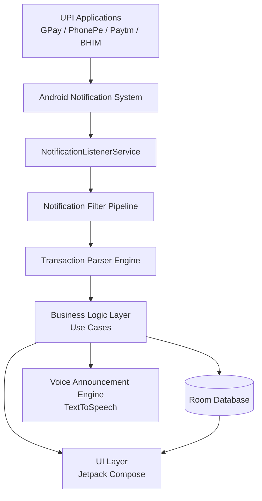
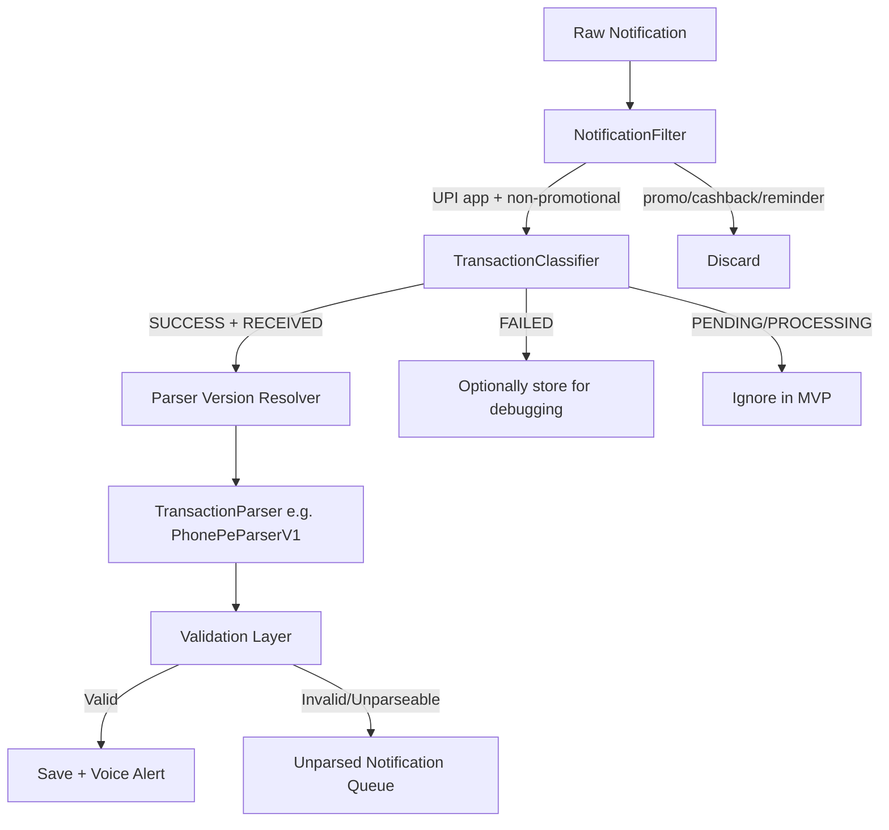
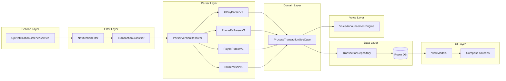
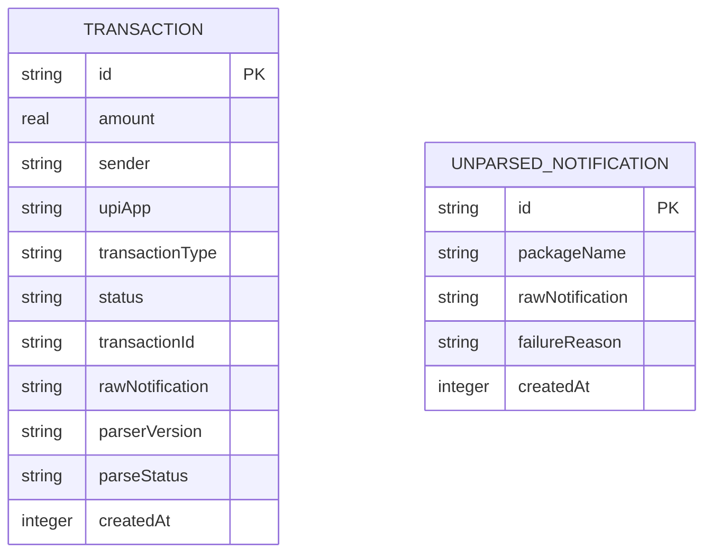
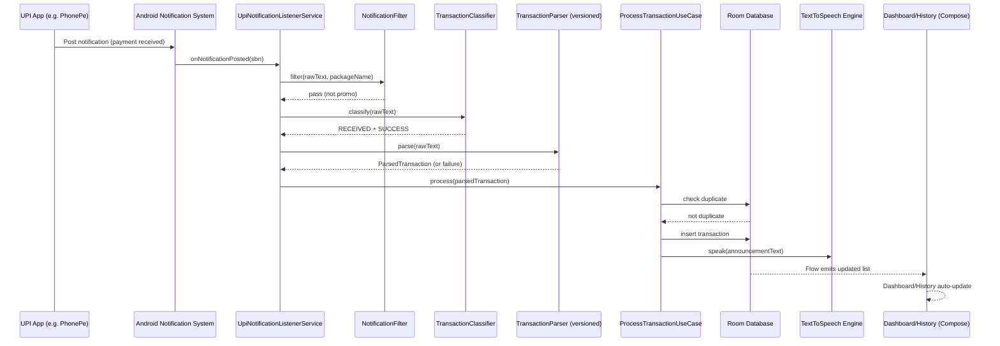

# CLAUDE.md — UPI Voice Alert Android Application
## Software Architecture Document (SAD)

**Status:** Finalized — approved for implementation
**Audience:** Implementation agent / developer new to Android
**Rule for the implementing agent:** Every decision needed to build the MVP is documented below. If something is genuinely not covered here, STOP and ask — do not guess, assume, or silently pick a default.

---

# 1. Introduction

## 1.1 Application Purpose
An Android application that listens to UPI payment notifications on the user's device (from Google Pay, PhonePe, Paytm, BHIM), detects **successful "payment received" transactions**, extracts the transaction details, stores a local transaction history, and speaks the payment out loud (e.g., *"Received five hundred rupees from Rahul via PhonePe"*) — without the user needing to look at the phone screen.

## 1.2 Problem Statement
Small merchants and shopkeepers accept UPI payments constantly throughout the day. They cannot keep checking their phone screen after every sale — they're busy handling customers, weighing goods, giving change, etc. Currently they rely on hearing a generic notification sound and manually unlocking the phone to confirm "did the payment actually come in, and how much?" This is slow, error-prone (fake payment screenshots / fraud rely on this exact confusion), and interrupts their workflow.

## 1.3 Target Users
- **Primary (MVP persona):** Small merchants / shopkeepers / vendors who accept UPI payments and need instant, hands-free audio confirmation.
- **Secondary (future):** Regular individual users who simply want spoken confirmation of payments received (e.g., landlords, freelancers, gig workers).

The architecture is built generically enough to support the secondary persona later, but MVP UX and priorities are shaped around the shopkeeper use case.

## 1.4 Real-World Use Cases
- A shopkeeper's customer pays via UPI; the shopkeeper hears "Received ₹500 from Rahul via PhonePe" without unlocking the phone, and hands over goods with confidence.
- A vendor reviews the day's transaction history at closing time without cross-checking multiple UPI apps individually.
- A user notices a payment was never announced and checks the "unparsed notifications" debug log to see why (future-facing capability, present in MVP internals but not user-facing).

## 1.5 Scope of MVP
**In scope:**
- Detect notifications from GPay, PhonePe, Paytm, BHIM
- Classify only **successful, RECEIVED** payments; filter out everything else
- Parse amount, sender, UPI app, reference ID (when available)
- Store transactions locally (Room database), including raw notification text
- Announce successful payments via offline Android TextToSpeech (English + Hindi)
- Basic UI: Dashboard, Transaction History, Settings
- Fully local — **no backend, no network calls, no cloud storage**
- Generic Android battery-optimization exemption request flow
- Internal debug log / unparsed-notification queue (not surfaced prominently to normal users)

**Out of scope for MVP:**
- SENT / REFUND / FAILED / PENDING transaction announcements (data model supports them; logic does not process them)
- Any backend, sync, or multi-device support
- OEM-specific automated workarounds (documented as known limitations only)
- Regional languages beyond English/Hindi
- Play Store publishing (architecture is Play-Store-ready, but MVP ships sideloaded)

## 1.6 Future Expansion Possibilities
- Expense tracking (SENT transactions), spending analytics, monthly reports, budget management
- Cloud sync / merchant dashboard / multi-device support
- AI-based transaction categorization
- WhatsApp/SMS daily reports
- OEM-specific onboarding flows
- Community-sourced parser format updates
- Play Store public release

---

# 2. Technology Stack

## 2.1 Frontend

| Technology | Why Selected | Where Used | Advantages | Limitations |
|---|---|---|---|---|
| **Kotlin** | Official language for Android; null-safety, coroutines, concise syntax — ideal for a learner building a modern app | Entire app codebase | Modern, safe, first-class Google support | Steeper learning curve than Java initially, but far better long-term |
| **Jetpack Compose** | Google's current recommended UI toolkit; declarative, less boilerplate than XML views | All UI screens (Dashboard, History, Settings) | Faster iteration, easier state management, modern paradigm | Newer ecosystem; some third-party libraries still catching up |
| **Android SDK** | Required to build any native Android app | Core platform APIs (notifications, TTS, permissions) | Full access to platform capability | Platform fragmentation across OEMs (see Section 7/OEM module) |
| **Material Design (Material 3)** | Google's design system; works natively with Compose | All screens, components, theming | Consistent, accessible, well-documented | Can feel generic without customization (acceptable for MVP) |

## 2.2 Architecture

| Pattern | Why Selected | Where Used |
|---|---|---|
| **MVVM** | Official recommended Android architecture; separates UI from business logic; works naturally with Compose + StateFlow | ViewModels per screen (DashboardViewModel, HistoryViewModel, SettingsViewModel) |
| **Clean Architecture principles** | Keeps parsing/business logic independent of Android framework classes, making it testable and future-proof (e.g., swapping Room for a remote DB later) | Layered as `data` / `domain` / `presentation` |
| **Repository Pattern** | Single source of truth abstraction between data sources (Room now, possibly remote API later) and the rest of the app | `TransactionRepository`, `SettingsRepository` |
| **Dependency Injection (Hilt)** | Industry standard; decided explicitly for long-term maintainability over easier alternatives (Koin was considered and rejected) | Injecting DAOs, repositories, use cases, TTS engine, parsers into ViewModels/Services |

## 2.3 Android Components

| Component | Why Selected | Where Used | Notes |
|---|---|---|---|
| **NotificationListenerService** | Only Android API that can read notification content from other apps | Core service capturing GPay/PhonePe/Paytm/BHIM notifications | Requires special user-granted permission (not a normal runtime permission) — see Module 1 |
| **TextToSpeech API** | Built-in, fully offline, no cost, no network dependency (hard MVP requirement) | Voice Announcement Engine | Voice quality varies by device; language pack must be installed on-device |
| **Room Database** | Official Android persistence library, built on SQLite, works cleanly with Coroutines/Flow | Local transaction storage | Local only in MVP — no sync |
| **DataStore Preferences** | Modern replacement for SharedPreferences; type-safe, coroutine-based | Storing user Settings (voice on/off, language, speed, consent flags) | Chosen over SharedPreferences per current Android best practice |
| **WorkManager** | Reliable deferred/periodic background execution, survives process death | Periodic cleanup of old raw notification data; retrying the failed-parse queue | **Not** used for real-time detection — that's the Listener Service's job (see Module 6) |

## 2.4 Development Tools

| Tool | Purpose |
|---|---|
| **Android Studio** | Primary IDE |
| **Gradle (Kotlin DSL)** | Build system, dependency management |
| **Git** | Version control |

## 2.5 Optional Future Backend (NOT built in MVP — documented for architectural continuity only)

| Technology | Future Role |
|---|---|
| **Node.js + Express** | REST API for cloud sync, merchant dashboard |
| **MongoDB** | Cloud transaction storage |
| **Firebase Authentication** | User accounts across devices |
| **Firebase Cloud Messaging** | Push notifications, multi-device alerts |

**MVP explicitly has zero network calls.** The Repository layer is designed so a future remote data source can be added without touching ViewModels or UI.

---

# 3. High-Level Design (HLD)

## 3.1 System Architecture Diagram



## 3.2 Data Flow — Step by Step
1. Customer completes a UPI payment; the paying UPI app posts a system notification (e.g., PhonePe shows "You received ₹500 from Rahul Kumar").
2. Android's Notification System delivers this notification to every app holding active Notification Listener access — including this app.
3. `NotificationListenerService.onNotificationPosted()` fires with the raw `StatusBarNotification`.
4. The **Notification Filter Pipeline** runs (Section 4, Module 2): package-name check → category filter (drop promos/cashback/reminders) → status classification (SUCCESS / FAILED / PENDING).
5. If classified as SUCCESS + RECEIVED, the appropriate versioned parser (e.g. `PhonePeParserV1`) extracts amount, sender, reference ID.
6. The Validation Layer checks extracted fields are sane (e.g., amount > 0). Valid → proceed. Invalid/unparseable → routed to the Unparsed Notification Queue instead.
7. The Business Logic Layer (a Use Case, e.g. `ProcessTransactionUseCase`) checks for duplicates (Section 4, Module 4), then persists the transaction via the Repository into Room.
8. On successful save, the Voice Announcement Engine is triggered to speak the transaction.
9. The UI Layer (Dashboard/History, observing the Room database via Flow) updates automatically — no manual refresh needed.

---

# 4. Low-Level Design (LLD)

## Module 1: Notification Listener Service

### How `NotificationListenerService` Works
It's a special Android `Service` subclass that, once granted the **`BIND_NOTIFICATION_LISTENER_SERVICE`** permission (via a special Settings screen the user must manually navigate to — this is not a normal runtime permission dialog), receives a callback for every notification posted on the device system-wide, not just from this app.

### Permissions Required
- **Special access:** `android.permission.BIND_NOTIFICATION_LISTENER_SERVICE`, declared in the manifest on the service, and the user must explicitly enable it via `Settings > Apps > Special app access > Notification access`. The app should deep-link the user there using the intent action `Settings.ACTION_NOTIFICATION_LISTENER_SETTINGS`.
- This is **not** requested via `ActivityCompat.requestPermissions()` — it has its own consent flow (see Section 7).
- **POST_NOTIFICATIONS** (Android 13+, `android.permission.POST_NOTIFICATIONS`) — only required if the app itself posts any notification (e.g., a mandatory foreground-service notification). See Section 7.4.

### Lifecycle
- `onListenerConnected()` — called when the system successfully binds the service after the user grants access. Good place to verify/re-sync state.
- `onNotificationPosted(StatusBarNotification sbn)` — called for every new notification, system-wide. This is the entry point into the Filter Pipeline.
- `onNotificationRemoved(StatusBarNotification sbn)` — notification dismissed; not used for core logic in MVP, but logged for debugging.
- `onListenerDisconnected()` — called if the system unbinds the service (can happen due to OEM battery killing — see Module 6 / Section 6 OEM Compatibility).

### Receiving Notifications
`onNotificationPosted()` gives a `StatusBarNotification`, from which the service extracts:
- `sbn.getPackageName()` — identifies the source app
- `sbn.getNotification().extras` — bundle containing `EXTRA_TITLE`, `EXTRA_TEXT`, `EXTRA_BIG_TEXT` (for expanded notification text, often more complete)

### Filtering UPI Applications
The service maintains a whitelist of known package names:

| App | Package Name |
|---|---|
| Google Pay | `com.google.android.apps.nbu.paisa.user` |
| PhonePe | `com.phonepe.app` |
| Paytm | `net.one97.paytm` |
| BHIM | `in.org.npci.upiapp` |

> **Note for implementer:** verify these package names against the currently installed app builds before hardcoding — package names occasionally change across major app rebrands. Do not guess; check the Play Store listing URL or `adb shell pm list packages` on a device with the app installed.

Notifications from any other package are discarded immediately, before entering the Filter Pipeline.

### Class Responsibility

```
UpiNotificationListenerService : NotificationListenerService
Responsibilities:
- Receive raw system notifications (onNotificationPosted)
- Filter by known UPI package names
- Forward candidate notifications to the Notification Filter Pipeline (Module 2)
- Does NOT parse, classify, or store anything itself — pure capture + routing
```

### Security Considerations
- The service must **never log or transmit raw notification content** off-device (MVP has no network layer at all, which structurally enforces this).
- Notification access is one of the most sensitive Android permissions — the app must clearly disclose, at first run, exactly which apps it reads and why (see Section 7).
- The service should defensively handle malformed/missing `extras` (a null title/text must not crash the service).

---

## Module 2: Notification Filter Pipeline & Parser Engine

### Why Separate Responsibilities
UPI apps issue many notification types beyond successful payments — cashback offers, promotions, reminders, "money request" alerts, and *different phrasing per app version*. A single monolithic parser would be fragile and untestable. Instead, responsibility is split into four distinct, independently testable components.

### Pipeline



### Component 1: `NotificationFilter`
**Responsibility:** Remove notifications that are not payment-success candidates at all.
- Confirms package name is a known UPI app (defense in depth, already filtered in Module 1)
- Drops notifications matching known non-payment keyword patterns: "cashback", "offer", "reward", "scratch card", "reminder", "request money", "bill due", promotional CTAs, etc. (keyword list stored as a configurable resource, not hardcoded inline, so it can be extended without code changes)
- Anything not confidently identified as promotional is passed through to the classifier — the filter is intentionally conservative (prefer false-pass-through over false-drop of a real payment).

### Component 2: `TransactionClassifier`
**Responsibility:** Determine **transaction type** and **status** from the notification text, before any field extraction happens.
- Type detection (MVP only acts on RECEIVED, but classifier still labels others for future use): keyword/pattern matching for "received", "sent", "refund", "failed", "pending"/"processing".
- Status detection: SUCCESS / FAILED / PENDING.
- Output: a lightweight `ClassificationResult(type: TransactionType, status: TransactionStatus)`, not yet the full transaction.
- Only `RECEIVED + SUCCESS` continues to the Parser Version Resolver in MVP. `FAILED` is optionally logged for debugging (not announced, not shown in main history). `PENDING` is ignored entirely in MVP.

### Component 3: Parser Version Resolver + `TransactionParser`
**Why versioned parsers per app:** UPI apps change their notification text format with app updates, with no warning and no changelog for third parties. A versioned architecture (`GPayParserV1`, `GPayParserV2`, ...) means:
- Old formats keep working if a device hasn't updated the UPI app
- New formats can be added as new parser classes without touching/breaking old ones
- Each parser version is independently unit-testable against saved sample notifications

**Resolver logic:** Given a package name, the resolver tries the parser versions registered for that app, most-recent-first, and uses the first one whose pattern matches the notification text (`canParse(text): Boolean`).

**Parser responsibility (each parser, e.g. `PhonePeParserV1`):**
- `canParse(rawText: String): Boolean` — quick pattern check
- `parse(rawText: String): ParsedTransaction` — extracts fields using regex/rule-based logic:
  - Amount
  - Sender name
  - UPI provider (known from package name, but confirmed/labeled at parse time)
  - Reference ID / UTR (if present in the notification text — not always available)
  - Timestamp (notification post time, from `StatusBarNotification.getPostTime()`)

**Input:** Raw notification text (title + expanded text)
**Output:** A `ParsedTransaction` object (see Transaction Model below), or a parse failure signal.

### Component 4: Validation Layer
- Confirms amount is a positive, sane number
- Confirms sender field is non-empty
- Confirms UPI app is a recognized value
- Pass → forwarded to the Business Logic Layer for dedup + save + voice
- Fail → routed to the **Unparsed Notification Queue**

### Unparsed Notification Queue (Failure Handling)
Parsing/validation failures are never silently dropped. Each failure is stored with:
- App package name
- Raw notification text
- Timestamp
- Failure reason (e.g., "no parser matched", "amount extraction failed", "validation failed: amount <= 0")

**MVP UI treatment:** not prominently exposed to normal users. Accessible only via:
- A **Debug Mode** toggle in Settings (off by default)
- A simple internal "Unparsed Notifications" history screen, only reachable when Debug Mode is on

**Future:** allow users to submit unparsed samples to help improve parser coverage.

### Transaction Model

```kotlin
enum class TransactionType {
    RECEIVED,   // Only this is processed for save+voice in MVP
    SENT,       // Future
    REFUND,     // Future
    FAILED,     // Classified but not announced in MVP
    PENDING     // Classified but ignored in MVP
}

enum class TransactionStatus {
    SUCCESS,
    FAILED,
    PENDING
}

enum class ParseStatus {
    PARSED,
    UNPARSED,
    VALIDATION_FAILED
}

data class Transaction(
    val id: String,                 // UUID, generated locally
    val amount: Double,
    val sender: String,
    val upiApp: String,             // e.g. "PhonePe"
    val transactionType: TransactionType,
    val status: TransactionStatus,
    val transactionId: String?,     // reference ID / UTR, nullable — not always present
    val rawNotification: String,    // full original notification text, always stored
    val parserVersion: String,      // e.g. "PhonePeParserV1"
    val parseStatus: ParseStatus,
    val createdAt: Long             // epoch millis, from notification post time
)
```

### Parser Testing Strategy
Real notification samples must be collected before parser implementation begins (Phase 2 activity — see Section 10). Do not hardcode parser regex against assumed/guessed formats.

```
notification_samples/
├── gpay/
│   ├── success_001.txt
│   ├── success_002.txt
│   └── failed_001.txt
├── phonepe/
│   ├── success_001.txt
│   └── ...
├── paytm/
│   └── ...
└── bhim/
    └── ...
```

Each parser has unit tests:
- **Input:** raw notification text from a sample file
- **Expected output:** the exact `ParsedTransaction` fields expected
- Test suite must include at least one success case, one failed-payment case, and one promotional/non-payment case (expected to be filtered before ever reaching the parser) per app.

---

## Module 3: Voice Announcement Engine

### Android TextToSpeech API
Fully offline, built into Android — no network call, no external service, satisfying the hard MVP requirement.

### Voice Generation Flow
1. `TextToSpeech` engine is initialized once (e.g., in a singleton/Hilt-provided class) at app/service startup, with an `OnInitListener` callback confirming readiness.
2. When a valid transaction is saved, the Business Logic Layer builds an announcement string via a template, e.g.:
   `"Received {amount formatted as currency} from {sender} via {upiApp}"`
   → *"Received five hundred rupees from Rahul via PhonePe."*
3. Amount is converted to spoken word form (not just read as digits) — e.g., ₹500 → "five hundred rupees" — using a number-to-words utility, locale-aware for English/Hindi.
4. `tts.speak(text, TextToSpeech.QUEUE_ADD, null, utteranceId)` is called — `QUEUE_ADD` so that if multiple payments arrive in quick succession, announcements queue rather than interrupt each other.

### Language Support (MVP: English + Hindi)
- `tts.isLanguageAvailable(Locale)` is checked before use; if the selected language's voice pack is not installed on-device, fall back to English and surface a one-time, non-blocking notice to the user (do not silently fail).
- Language preference stored via DataStore, read by the announcement builder to pick both the phrasing template and the TTS `Locale`.
- Architecture keeps the phrase templates in a resource-based, locale-keyed structure so more languages can be added later without touching business logic.

### Speech Speed Control
- `tts.setSpeechRate(rate: Float)` — exposed in Settings as a slider (e.g., 0.5x–2.0x), stored in DataStore, applied before each `speak()` call.

### Volume Handling
- MVP uses the device's current media/notification volume stream; TTS is set to use `AudioManager.STREAM_MUSIC` (or `STREAM_NOTIFICATION`, to be decided during implementation based on testing — **not a guess to make silently if behavior is ambiguous on a given device; test and document the choice**).
- A voice enable/disable toggle in Settings fully bypasses the `speak()` call when off — transactions are still saved and shown in history either way.

---

## Module 4: Local Database Layer

### Room Database Architecture

```
Entity  →  TransactionEntity (maps to Transaction Table)
DAO     →  TransactionDao (insert, query, delete, dedup-check queries)
Database → AppDatabase (Room database holder)
Repository → TransactionRepository (single source of truth, exposes Flow<List<Transaction>> to ViewModels; wraps DAO calls; NOT a raw pass-through — this is where dedup logic and domain-model mapping live)
```

### Database Schema — Transaction Table

| Column | Type | Notes |
|---|---|---|
| id | TEXT (PK) | UUID |
| amount | REAL | |
| sender | TEXT | |
| upiApp | TEXT | e.g. "PhonePe" |
| transactionType | TEXT | enum name |
| status | TEXT | enum name |
| transactionId | TEXT (nullable) | reference ID / UTR |
| rawNotification | TEXT | full original notification text |
| parserVersion | TEXT | e.g. "PhonePeParserV1" |
| parseStatus | TEXT | enum name |
| createdAt | INTEGER | epoch millis |

A second table, `UnparsedNotificationEntity`, stores failed-parse records:

| Column | Type | Notes |
|---|---|---|
| id | TEXT (PK) | UUID |
| packageName | TEXT | |
| rawNotification | TEXT | |
| failureReason | TEXT | |
| createdAt | INTEGER | epoch millis |

### Deduplication Strategy (Hybrid)
Implemented in `TransactionRepository`, before insert:
1. **Primary key match:** if the incoming transaction has a non-null `transactionId` (reference ID/UTR), check for an existing row with the same `transactionId` + `upiApp`. If found → duplicate, discard.
2. **Fallback fuzzy match:** if `transactionId` is null (not all UPI apps expose it in the notification), check for an existing transaction with the same `amount` + `sender` + `upiApp` within a short time window (**default: 2 minutes** — configurable constant, not hardcoded magic number scattered in code) of the incoming notification's `createdAt`. If found → treat as duplicate (covers the common "Processing" → "Success" repost pattern).
3. If neither match is found → insert as a new transaction.

---

## Module 5: User Interface Layer (Jetpack Compose)

### Screen 1: Dashboard
- Total transactions count (today / all-time toggle)
- Latest payment received (amount, sender, app, time) — prominent card
- Quick visual indicator that the Notification Listener is active/inactive (important given OEM kill risk — see Section 6)

### Screen 2: Transaction History
- Reverse-chronological list of RECEIVED/SUCCESS transactions
- Each item: amount, sender, UPI app icon, time, reference ID if available
- Tap to view full detail (including raw notification text, for transparency/debugging)
- Empty state guidance if no transactions yet (with a check of whether Notification Access is even granted)

### Screen 3: Settings
- Enable/disable voice announcements
- Language selection (English / Hindi)
- Speech speed control
- Supported UPI apps (read-only list, MVP: GPay/PhonePe/Paytm/BHIM — informational)
- Notification Access status + deep link to grant it if missing
- Battery optimization exemption status + deep link to request it
- Debug Mode toggle (unlocks Unparsed Notifications screen)
- Privacy/data-handling explanation link (see Section 7)

---

# 5. Application Folder Structure

```
app
│
├── data
│   ├── database
│   │   ├── AppDatabase.kt
│   │   ├── TransactionEntity.kt
│   │   ├── TransactionDao.kt
│   │   ├── UnparsedNotificationEntity.kt
│   │   └── UnparsedNotificationDao.kt
│   ├── repository
│   │   ├── TransactionRepositoryImpl.kt
│   │   └── SettingsRepositoryImpl.kt
│   ├── datastore
│   │   └── SettingsDataStore.kt
│   └── model
│       └── (data-layer DTOs/mappers between Entity and Domain models)
│
├── domain
│   ├── model
│   │   ├── Transaction.kt
│   │   ├── TransactionType.kt
│   │   ├── TransactionStatus.kt
│   │   └── ParseStatus.kt
│   ├── repository
│   │   ├── TransactionRepository.kt      (interface)
│   │   └── SettingsRepository.kt         (interface)
│   └── usecases
│       ├── ProcessTransactionUseCase.kt
│       ├── GetTransactionHistoryUseCase.kt
│       ├── CheckDuplicateUseCase.kt
│       └── RetryUnparsedQueueUseCase.kt
│
├── service
│   └── UpiNotificationListenerService.kt
│
├── filter
│   ├── NotificationFilter.kt
│   └── TransactionClassifier.kt
│
├── parser
│   ├── ParserVersionResolver.kt
│   ├── TransactionParser.kt              (interface)
│   ├── gpay
│   │   ├── GPayParserV1.kt
│   ├── phonepe
│   │   ├── PhonePeParserV1.kt
│   ├── paytm
│   │   ├── PaytmParserV1.kt
│   └── bhim
│       └── BhimParserV1.kt
│
├── voice
│   ├── VoiceAnnouncementEngine.kt
│   ├── AmountToWordsConverter.kt
│   └── AnnouncementTemplates.kt
│
├── ui
│   ├── dashboard
│   │   ├── DashboardScreen.kt
│   │   └── DashboardViewModel.kt
│   ├── history
│   │   ├── HistoryScreen.kt
│   │   └── HistoryViewModel.kt
│   ├── settings
│   │   ├── SettingsScreen.kt
│   │   └── SettingsViewModel.kt
│   ├── debug
│   │   ├── UnparsedNotificationsScreen.kt
│   │   └── UnparsedNotificationsViewModel.kt
│   ├── onboarding
│   │   ├── ConsentScreen.kt
│   │   ├── PrivacyExplanationScreen.kt
│   │   └── PermissionSetupScreen.kt
│   └── theme
│       └── (Material 3 theme files)
│
├── work
│   ├── CleanupWorker.kt
│   └── RetryFailedParseWorker.kt
│
├── di
│   ├── DatabaseModule.kt
│   ├── RepositoryModule.kt
│   └── AppModule.kt
│
└── utils
    ├── PackageNames.kt
    ├── DateTimeUtils.kt
    ├── BatteryOptimizationHelper.kt
    └── Constants.kt
```

### Folder Responsibilities
- **data/** — everything touching actual storage: Room, DataStore, repository implementations. Nothing here should be referenced directly by UI.
- **domain/** — pure Kotlin, no Android framework dependencies where avoidable; business rules, use cases, domain models, repository interfaces. This is the testable core.
- **service/** — the `NotificationListenerService`; thin, delegates to filter/parser/domain layers.
- **filter/** — `NotificationFilter` and `TransactionClassifier`, kept separate from `parser/` per the agreed component split.
- **parser/** — per-app, versioned parsers plus the resolver.
- **voice/** — TTS wrapper and announcement text generation.
- **ui/** — Compose screens and ViewModels, one subfolder per screen; MVVM boundary enforced here.
- **work/** — WorkManager workers (cleanup, retry queue only — no real-time logic).
- **di/** — Hilt modules.
- **utils/** — shared helpers with no business logic of their own.

---

# 6. Data Flow Explanation (End to End)

```
Customer sends payment
        ↓
UPI app generates notification
        ↓
Android notification system broadcasts it
        ↓
UpiNotificationListenerService captures it (known package name only)
        ↓
NotificationFilter drops promo/cashback/reminder noise
        ↓
TransactionClassifier determines type + status
        ↓
   RECEIVED + SUCCESS?  ── No ──→ (FAILED: optional debug log | PENDING: ignored)
        │ Yes
        ↓
ParserVersionResolver picks matching versioned parser
        ↓
TransactionParser extracts amount, sender, app, reference ID
        ↓
Validation Layer checks extracted data
        │
   Valid? ── No ──→ Unparsed Notification Queue (stored, not announced)
        │ Yes
        ↓
Deduplication check (reference ID, or amount+sender+app+time-window fallback)
        │
   Duplicate? ── Yes ──→ Discard (not re-saved, not re-announced)
        │ No
        ↓
Transaction saved to Room (with raw text, parser version, parse status)
        ↓
Voice announcement triggered (if enabled in Settings)
        ↓
UI (Dashboard/History) updates automatically via Room Flow
```

---

# 7. Security and Privacy Design

## 7.1 Notification Permission Disclosure
Notification Listener access is one of Android's most sensitive permissions — it grants visibility into **all** notifications on the device, not just UPI apps. The app must:
- Show a clear **Privacy Explanation Screen** before requesting access, explicitly stating: *"This app only reads notifications from GPay, PhonePe, Paytm, and BHIM to detect payment confirmations. It ignores and does not store notifications from any other app. All data stays on your device."*
- Only deep-link to the system Notification Access settings screen after the user has seen this explanation and tapped "Continue" (explicit consent gesture, not implied).

## 7.2 User Consent Flow
1. First app launch → **Consent Screen** (what the app does, what it accesses, that it's fully offline/local)
2. → **Privacy Explanation Screen** (detail on notification scope, data retention, no third-party sharing)
3. → **Permission Setup Screen** (guided steps: grant Notification Access, then optionally request battery optimization exemption)
4. Consent acknowledgment stored in DataStore (`hasAcceptedPrivacyDisclosure: Boolean`) — the app must not proceed past onboarding without this being true.

## 7.3 Data Handling Principles
- **All data stays on-device** in MVP — no analytics SDKs, no crash-reporting SDKs that phone home by default, no network calls of any kind.
- Non-UPI-app notifications are **never stored, logged, or processed** — filtered out at the earliest possible point (Module 1, package-name check), before even reaching the filter pipeline.
- Raw notification text for UPI apps *is* stored locally (agreed decision, for debugging/reprocessing), but this stays local to the device's Room database — never transmitted anywhere in MVP.
- User can clear all stored data from Settings (future-friendly requirement to design for, even if the delete-all UI action is a simple MVP button).

## 7.4 Minimal Permission Usage
- Only request: Notification Listener access, battery optimization exemption (optional, user-initiated), and `POST_NOTIFICATIONS` (Android 13+, **only if** a foreground-service notification is actually required — see below).
- No camera, contacts, storage, location, or SMS permissions — none are needed and none should be requested.

## 7.5 POST_NOTIFICATIONS Handling (Android 13+)
- If `UpiNotificationListenerService` needs to run as a foreground service for reliability (common pattern to reduce OEM kills), Android requires an ongoing notification to be shown — which itself requires the runtime `POST_NOTIFICATIONS` permission on API 33+.
- This must be requested via the standard runtime permission dialog (`ActivityCompat.requestPermissions`), with a clear explanation shown first: *"Android requires a persistent notification to keep payment detection running reliably in the background."*
- MVP avoids **any other** app-generated notifications beyond this one required foreground-service notification, per the agreed minimal-permission principle.

## 7.6 Sensitive Transaction Data Protection
- Room database is app-private storage by default (not accessible to other apps without root).
- No transaction data is included in Android backups unless explicitly reviewed — set `android:allowBackup` and `dataExtractionRules` deliberately (default to excluding the database from auto-backup, given the financial nature of the data), and confirm this choice during implementation rather than accepting the Android default silently.
- No screenshots restriction is required for MVP given the app is not displaying full card/PIN data, but this should be revisited before any public release.

## 7.7 Future Requirements for Google Play Store Publishing
- **Notification Access declaration form:** Google requires a Play Console declaration explaining exactly why the app needs Notification Listener access, with an in-app disclosure meeting Google's specific wording/placement requirements.
- **Prominent disclosure:** the privacy explanation must be shown *before* the permission is requested, and must be easily re-accessible from Settings (already satisfied by the MVP design above).
- **Privacy Policy URL** required in the Play Console listing, covering data collected (even though it's none, transmitted) and data accessed on-device.
- **Data safety section** in Play Console must accurately reflect: notification content accessed, no data collected/shared/transmitted (true for MVP).
- Google may require a demo video or additional justification specifically for financial-notification-reading apps during review — budget extra review time.
- Any future addition of a backend/cloud sync will require updating the Data Safety section and privacy policy accordingly, and likely re-review.

---

# 8. Error Handling Strategy

| Failure Scenario | Handling Strategy |
|---|---|
| **Notification format changes** (UPI app update breaks a parser) | Parser's `canParse()` returns false → falls through to Unparsed Notification Queue with reason "no parser matched"; existing versioned parser stays intact for old format; a new parser version is added later without breaking history |
| **Missing amount** | Validation Layer rejects the parsed result → routed to Unparsed Queue with reason "amount extraction failed"; never silently defaults to 0 or a guessed value |
| **Duplicate transactions** | Handled by hybrid dedup logic in `TransactionRepository` (Module 4) before insert; duplicates are discarded, not saved, not announced |
| **App crashes** | Service should be resilient to malformed `StatusBarNotification` data (null-safe extraction, try/catch around parsing — a parser exception must never crash the listener service, since that risks losing Notification Access until manually re-granted) |
| **Text-to-Speech failure** (engine not initialized, language pack missing) | Transaction is still saved regardless of TTS outcome; if TTS fails, log locally and optionally surface a one-time non-blocking Settings notice; never block the save pipeline on voice success |
| **Database errors** (Room write failure, disk full, etc.) | Wrapped in try/catch at Repository level; on failure, do not proceed to voice announcement (avoid announcing a transaction that wasn't actually persisted); surface a generic error state to Dashboard if persistent |
| **Notification Listener disconnected** (OEM kill) | `onListenerDisconnected()` logged; Dashboard shows listener-inactive status (Module 5); WorkManager-based health check is a **future** enhancement, not MVP |

---

# 9. Future Scalability Design

- **Merchant payment assistant:** daily/weekly summaries spoken or shown on Dashboard, multi-till support
- **Cloud dashboard:** Node.js/Express + MongoDB backend (Section 2.5) enabling web-based transaction viewing
- **Multiple devices:** Firebase Authentication for account-based sync across a merchant's devices
- **Business analytics:** spending/receiving trends, peak-hour analysis
- **AI transaction categorization:** auto-tagging transactions (e.g., by customer, by product line) using on-device or cloud ML
- **WhatsApp/SMS reports:** daily automated summary messages via Firebase Cloud Messaging + a messaging integration
- The Repository Pattern and Clean Architecture boundaries established in MVP are what make all of the above addable without rewriting the domain or UI layers — only new data sources and use cases need to be added.

---

# 10. Development Roadmap

**Phase 1 — Basic Notification Detection**
- Implement `UpiNotificationListenerService`, package-name filtering, Notification Access consent flow
- Log raw notifications from the 4 target apps to confirm capture works reliably

**Phase 2 — Notification Sample Collection & Transaction Parsing**
- Collect real notification samples (success/failed/pending/promo) from all 4 apps
- Build `notification_samples/` test dataset
- Implement `NotificationFilter`, `TransactionClassifier`, and V1 parsers per app with unit tests
- Implement Validation Layer and Unparsed Notification Queue

**Phase 3 — Voice Announcement**
- Integrate TextToSpeech engine, amount-to-words conversion, English + Hindi templates
- Implement Settings-driven voice enable/disable, speed control

**Phase 4 — Transaction History**
- Room database, DAO, Repository, dedup logic
- Dashboard and Transaction History screens

**Phase 5 — Settings and Customization**
- Full Settings screen (language, speed, voice toggle, permission status, debug mode)
- Onboarding: Consent Screen, Privacy Explanation Screen, Permission Setup Screen
- Battery optimization exemption request flow
- WorkManager: cleanup worker + failed-parse retry worker

**Phase 6 — Cloud Integration (Future, post-MVP)**
- Not started until MVP is stable and validated with real merchant usage

---

# 11. Learning Guide (for a Developer New to Android)

## Recommended Learning Order
1. **Kotlin fundamentals** — null safety, data classes, coroutines basics, sealed classes/enums (needed immediately for the Transaction model)
2. **Android app basics** — Activities, the manifest file, app lifecycle, Gradle basics (build a trivial "Hello World" app first, unrelated to this project, to get oriented)
3. **Jetpack Compose fundamentals** — Composables, state hoisting (`remember`, `mutableStateOf`), navigation between screens
4. **Coroutines + Flow** — essential for Room queries and reactive UI updates
5. **MVVM in practice** — ViewModel, StateFlow, how UI observes state
6. **Room database** — Entities, DAOs, migrations
7. **DataStore Preferences** — simple key-value reactive storage
8. **Dependency Injection with Hilt** — annotations (`@HiltAndroidApp`, `@Inject`, `@Module`, `@Provides`), why DI matters
9. **Services in Android**, specifically **NotificationListenerService** — a less common API, study Android's official docs and sample implementations specifically for this
10. **TextToSpeech API** — small, self-contained, easy to learn in isolation
11. **WorkManager** — periodic/deferred background work, constraints

## Concepts Required Before Writing Any Code for This App
- Understand what a `Service` is vs. an `Activity` (this app is service-heavy, unusual for a first Android project)
- Understand Android's permission model, and specifically that **Notification Access is a "special permission,"** fundamentally different from a normal runtime permission (this trips up many learners)
- Understand `Flow`/reactive streams well enough that "UI updates automatically when the database changes" isn't a mystery
- Understand that regex-based parsing is inherently fragile and why the versioned-parser architecture exists — this shapes how the parser module should be approached, not just coded

## Suggested Approach
Build and test Phase 1 (raw notification capture, logged to Logcat) *before* writing a single line of parser or database code. Confirming the Listener Service actually reliably fires on a real device with real UPI apps installed is the highest-risk unknown in this whole project — validate it first.

---

# 12. Diagrams

## 12.1 System Architecture Diagram
See Section 3.1.

## 12.2 Component Diagram



## 12.3 Data Flow Diagram
See Section 6.

## 12.4 Database Relationship Diagram


*(No foreign-key relationship between the two tables in MVP — they are independent logs; a successfully re-parsed unparsed record simply creates a new `TRANSACTION` row rather than being linked back.)*

## 12.5 Sequence Diagram — Payment Detection



---

# Appendix: Rules for the Implementing Agent

1. Do not implement SENT, REFUND, or PENDING announcement logic in MVP — the enums exist, the processing logic must not.
2. Do not add any network call, analytics SDK, or crash reporter that transmits data off-device without explicit new approval — MVP is offline-only by design and by privacy commitment.
3. Do not hardcode UPI app package names without verifying them against real installed apps first (Module 1 note).
4. Do not build parser regex against assumed/guessed notification formats — real samples must be collected first (Section 10, Phase 2).
5. Do not skip the Consent Screen / Privacy Explanation Screen flow, even in early internal builds — build it from Phase 5 onward as scheduled, but the onboarding requirement itself is non-negotiable before shipping to any real device with real notification access granted.
6. Do not use WorkManager for real-time transaction detection — that responsibility belongs solely to `NotificationListenerService`.
7. Do not silently swallow parser or validation failures — they must always land in the Unparsed Notification Queue with a reason.
8. If any requirement in this document is ambiguous or missing information needed to proceed (e.g., an exact package name, an exact notification string format, a specific Android API behavior on a target OEM), **stop and ask** rather than guessing or picking an arbitrary default.